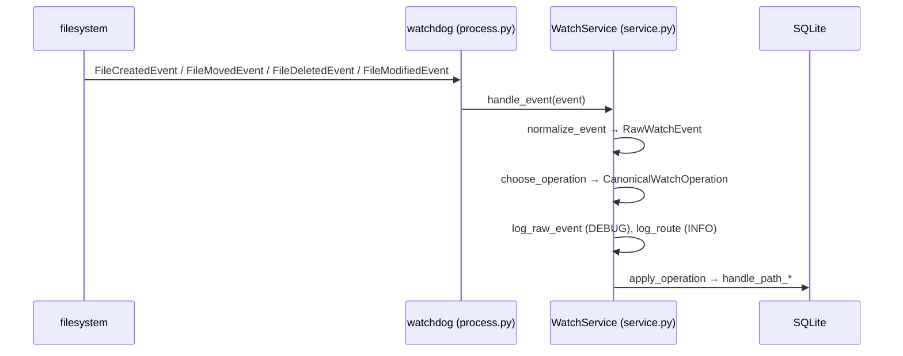

# File Watching

Keeps `document_paths` in sync with actual files under `PDFZX_PDF_ROOT` by reacting to raw filesystem events in real time.

## Running the watcher

```bash
python client.py watch
python client.py watch --log-level DEBUG
```

Runs in the foreground. Interrupt with `Ctrl+C`.

## Code structure

```
pdfzx/watch/
  __init__.py       re-exports public symbols
  events.py         RawWatchEvent, CanonicalWatchOperation dataclasses
  service.py        WatchService — normalize, route, apply
  process.py        run_watch_process — thin watchdog adapter
```

### Flow



### Canonical operations

| Operation | Trigger | DB effect |
|---|---|---|
| `path_discovered` | `created`, or `modified` on untracked path | create/update `Document`, upsert `DocumentPath` |
| `path_moved` | `moved` within root | update `DocumentPath.rel_path`, update `Document.file_name` |
| `path_missing` | `deleted`, or `moved` leaving root | delete `DocumentPath` |

`FileModifiedEvent` routing:

- path **not in** `document_paths` → `path_discovered` (handles macOS clone/copy via Finder or iCloud)
- path **already in** `document_paths` → ignored (open/read noise)

### Key classes and methods

**`WatchService`** (`service.py`)

```python
WatchService(root=Path, config=ScanConfig | None, logger=Logger | None)
```

| Method | Purpose |
|---|---|
| `handle_event(event)` | full pipeline: normalize → route → apply |
| `handle_path_discovered(rel_path)` | scan + upsert document and path rows + taxonomy sync |
| `handle_path_moved(old_rel_path, new_rel_path)` | move path row, fallback to discovery + taxonomy sync |
| `handle_path_missing(rel_path)` | delete path row + taxonomy sync |
| `close()` | dispose SQLite engine |

`handle_path_discovered`, `handle_path_moved`, `handle_path_missing` are also called directly by `_reconcile_document_paths` in `client.py` for drift repair outside the watcher loop.

**`run_watch_process`** (`process.py`)

Starts a `watchdog.Observer`, attaches a handler that forwards every event to `WatchService.handle_event`, then blocks until `KeyboardInterrupt`.

## Taxonomy sync ⚠️ implemented, not yet verified

### Root membership sync

Every document is linked to the root taxonomy node (`PDFZX_TAXONOMY_ROOT_NAME`, default `Root`) as a global index entry. The same setting also names the watched filesystem folder prefix used for `Root/...` path inference.

| Event | DB effect |
|---|---|
| `path_discovered` | add document to root node; if path is under `Root/`, also add to the specific node chain (creating nodes if missing) |
| `path_moved` | remove from old node if was under `Root/`; add to new node if moving into `Root/` |
| `path_missing` | remove from specific node if under `Root/`; remove from root node if this was the last path |

A file at `Root/Math/Physics/paper.pdf` triggers creation of `Root`, `Root/Math`, and `Root/Math/Physics` nodes if they do not exist, then links the document to the leaf node.

### manual_touched

When a file is physically moved into or within `Root/` on the filesystem, any existing `TaxonomyAssignment` rows for that document are marked `manual_touched`. This signals that the user has manually placed the file and the LLM workflow should not overwrite it.

`upsert_assignment` also guards against resetting `applied` or `manual_touched` status back to `pending` on re-run.

### approve_assignment — not yet implemented

The deliberate user action of approving an LLM taxonomy suggestion (moving the file to `Root/<node>/` and marking the assignment `applied`) is not yet implemented. It requires a filesystem move operation and belongs in a planned `operations.py` public API.

## Extending

To add a new canonical operation (e.g. `path_reconcile`), add the routing case to `choose_operation` and a dispatch branch in `apply_operation`, then implement `handle_path_reconcile`.

## Logging

Two layers:

| Layer | Logger | Level | Fields |
|---|---|---|---|
| Adapter | `pdfzx.watch` | DEBUG | `event`, `etype`, `src`, `dst`, `synthetic` |
| Service | `pdfzx.watch` | INFO | `op`, `src`/`dst`/`path`, `sha256` |

Example output for a copy into root:

```json
{"level":"DEBUG","msg":"watch.raw","event":"FileModifiedEvent","etype":"modified","src":"Root/Math/paper.pdf","dst":null,"synthetic":false}
{"level":"INFO", "msg":"watch.route","op":"path_discovered","src":"Root/Math/paper.pdf","why":"modified event on untracked path - likely copy or clone"}
{"level":"INFO", "msg":"watch.db",  "op":"document_created","sha256":"abc123...","path":"Root/Math/paper.pdf"}
```
