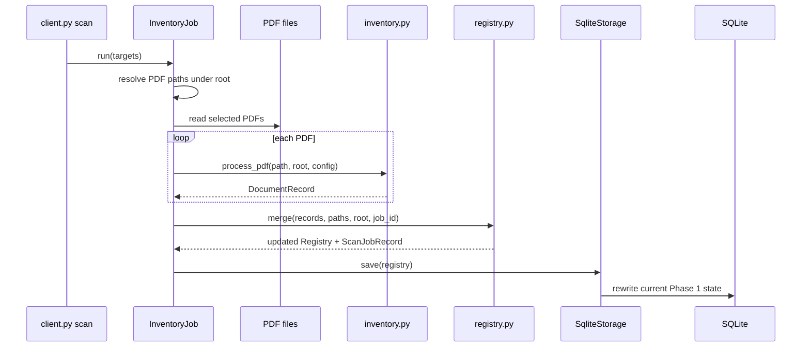
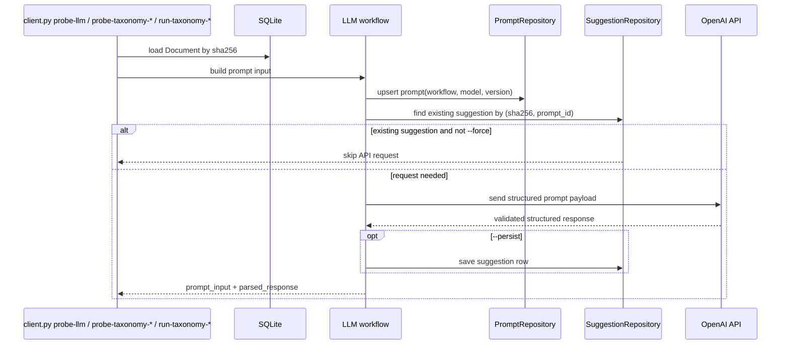

# Phase Flow

## Phase 1

Phase 1 is an offline batch scan.
Its current persistence model is SQLite-backed, but the merge still happens through the in-memory
`Registry` contract.

Current Phase 1 state split:

- canonical document state
  - `documents`
  - `document_paths`
  - `document_toc`
- batch scan state
  - `scanned_file_in_job`
  - `scan_jobs`

Practical meaning:

- `document_paths` answers which relative paths currently belong to a document
- `scanned_file_in_job` answers what the last scan run saw at a path
- legacy JSON key for that scan-state map: `file_stats`

`db.json` is not the normal write target anymore.
It is retained only for import/export and compatibility.

## Phase 2

Phase 2 is online and prompt-driven.
It consumes Phase 1 document state from SQLite and stores prompt-backed suggestions separately from
the canonical scanned document record.
