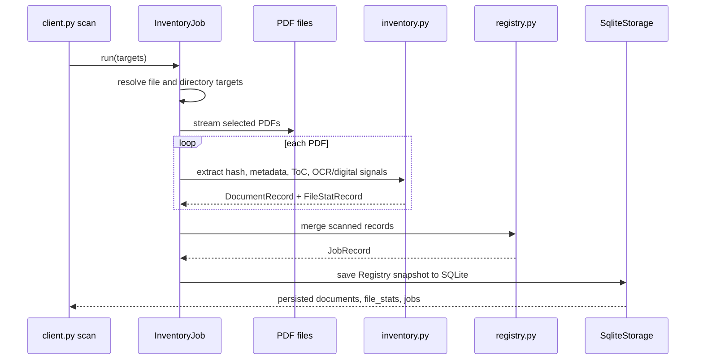
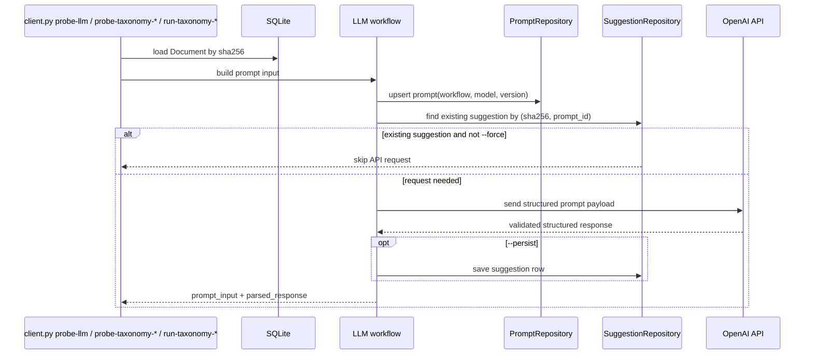

# Phase Flow

## Phase 1

Phase 1 is offline only. It computes deterministic records from the filesystem and writes the
merged registry to SQLite. JSON is import/export only.

## Phase 2

Phase 2 is online and prompt-driven. The scanned Phase 1 document stays canonical. LLM outputs
are stored as separate suggestion rows with prompt provenance and review/apply state.
